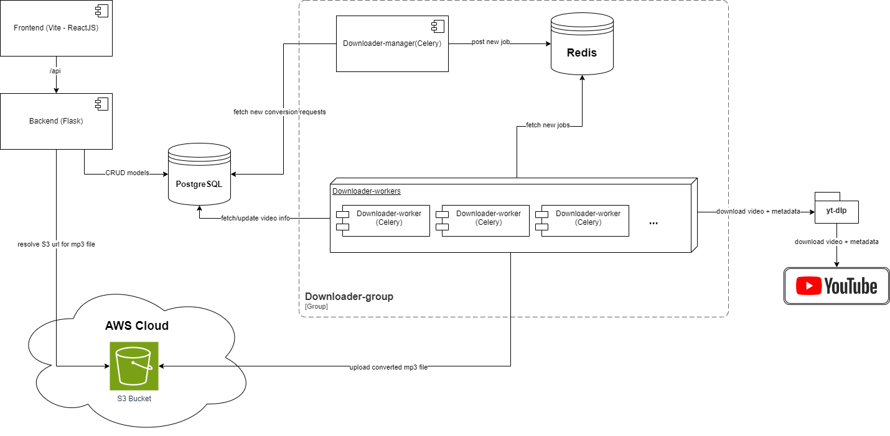
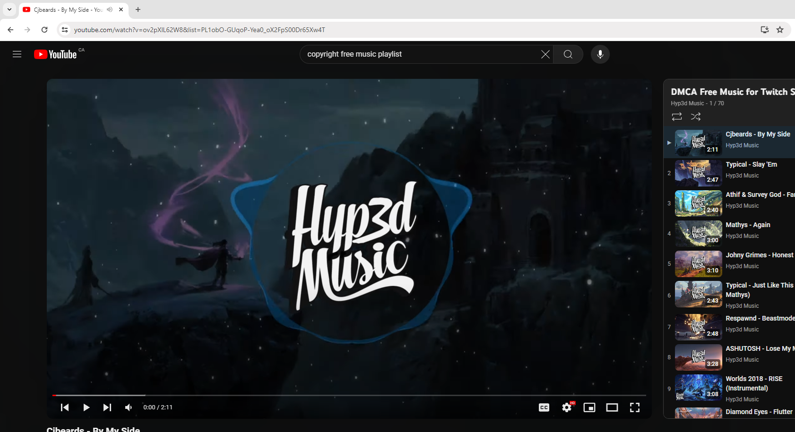
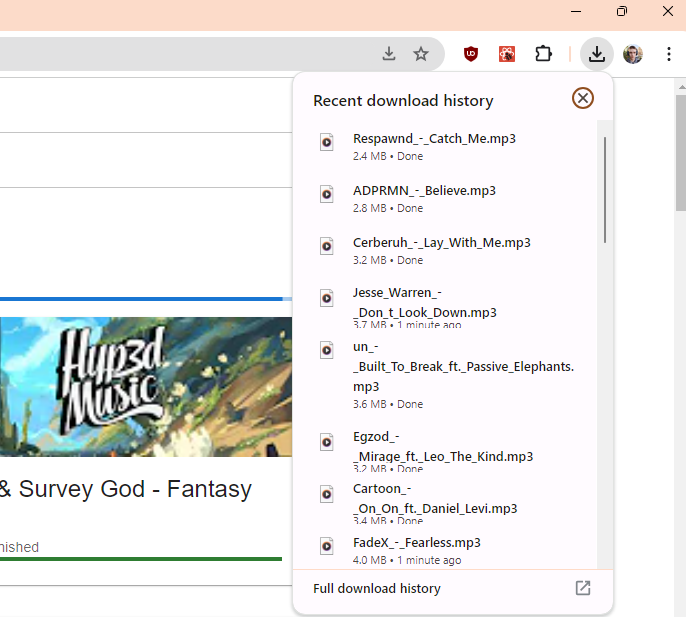

# Youtube to mp3
Allows user to download youtube videos as audio files. Run `docker-compose up` and YTMusic will be running @ http://localhost:5173

## Limitations
YTMusic is meant to be hosted for personal use as mass downloading can result in rate limits being applied to the IP address of the worker. A proxy could be used but is not currently supported by YTMusic.

# Architecture

The basic flow for a user is to navigate the website through the frontend (see screenshots below) and create a conversion job by entering the url of the video or the playlist.

The conversion request is then inserted to the postgreSQL database by the backend. 

The downloader-manager will fetch that new request and pass it to one of the downloader-worker instance using Redis. The worker will use yt-dlp to download the audio track and ffmpeg to convert to mp3. It will then upload the mp3 file to an Amazon S3 bucket and update the conversion status in PostgreSQL to mark it as complete with the S3 key.

The frontend will periodically fetch the result of the conversion jobs and will download the mp3 file for the user when the conversion completes.

# Usage (end user)

## Step 1 - Finding a video or playlist on Youtube

## Step 2 - Enter the URL into YTMusic

## Step 3 - You can either download the current video or the entire playlist

## Step 4 - When a download completes, the card gets a green checkmark and the download starts in your browser

## Step 6 - The MP3 files are now in your downloads folder

